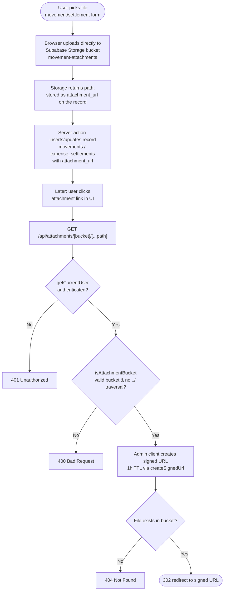

# File uploading (attachments)

```mermaid
flowchart TD
    A([User picks file<br/>movement/settlement form]) --> B[Browser uploads directly to<br/>Supabase Storage bucket<br/>movement-attachments]
    B --> C[Storage returns path;<br/>stored as attachment_url on the record]
    C --> D[Server action inserts/updates record<br/>movements / expense_settlements<br/>with attachment_url]
    D --> E[Later: user clicks<br/>attachment link in UI]
    E --> F["GET /api/attachments/[bucket]/[...path]"]
    F --> G{getCurrentUser<br/>authenticated?}
    G -->|No| H[401 Unauthorized]
    G -->|Yes| I{isAttachmentBucket<br/>valid bucket & no ../ traversal?}
    I -->|No| J[400 Bad Request]
    I -->|Yes| K[Admin client creates signed URL<br/>1h TTL via createSignedUrl]
    K --> L{File exists in bucket?}
    L -->|No| M[404 Not Found]
    L -->|Yes| N([302 redirect to signed URL])
```
