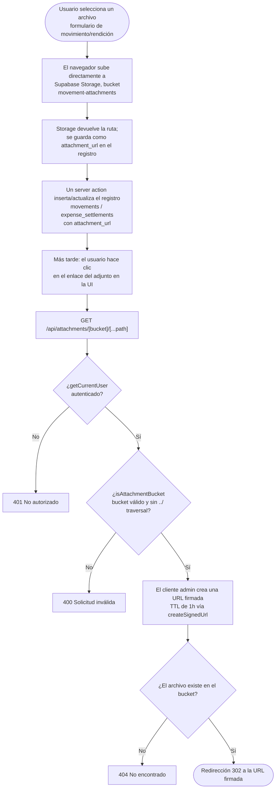

# Carga de archivos (adjuntos)

Subida desde un formulario (movimiento o rendición) hasta Supabase Storage, y su
recuperación posterior mediante una URL firmada a través de
`/api/attachments/[bucket]/[...path]`.

