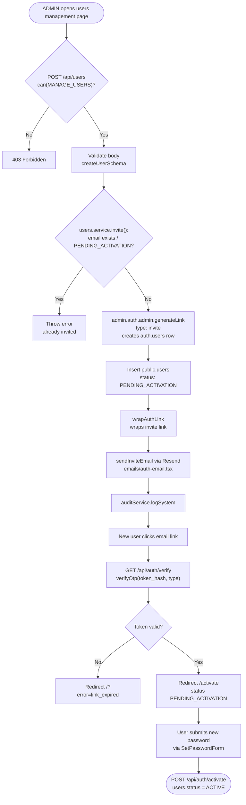

# Account creation (admin invite)

```mermaid
flowchart TD
    A([ADMIN opens users management page]) --> B{"POST /api/users<br/>can(MANAGE_USERS)?"}
    B -->|No| C[403 Forbidden]
    B -->|Yes| D[Validate body<br/>createUserSchema]
    D --> E{"users.service.invite():<br/>email exists / PENDING_ACTIVATION?"}
    E -->|Yes| F[Throw error<br/>already invited]
    E -->|No| G["admin.auth.admin.generateLink<br/>type: invite<br/>creates auth.users row"]
    G --> H[Insert public.users<br/>status: PENDING_ACTIVATION]
    H --> I[wrapAuthLink<br/>wraps invite link]
    I --> J[sendInviteEmail via Resend<br/>emails/auth-email.tsx]
    J --> K[auditService.logSystem]
    K --> L[New user clicks email link]
    L --> M["GET /api/auth/verify<br/>verifyOtp(token_hash, type)"]
    M --> N{Token valid?}
    N -->|No| O[Redirect /?error=link_expired]
    N -->|Yes| P[Redirect /activate<br/>status PENDING_ACTIVATION]
    P --> Q[User submits new password<br/>via SetPasswordForm]
    Q --> R([POST /api/auth/activate<br/>users.status = ACTIVE])
```
