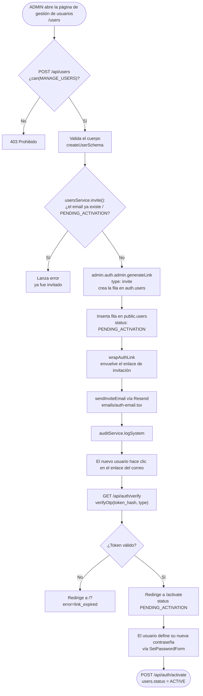

# Creación de cuenta (invitación de administrador)

Solo un ADMIN (permiso `MANAGE_USERS`) puede crear cuentas — no existe registro público.

Ver también [roles.md](../roles.md#creating-users) para el detalle de permisos y estados de
usuario, y [07-login-and-impersonation.md](07-login-and-impersonation.md) para el flujo de inicio de
sesión posterior a la activación.
