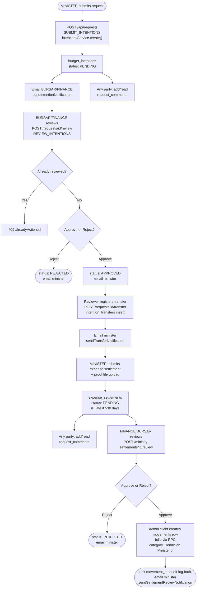

# Requests flow (budget intentions workflow)

```mermaid
flowchart TD
    A([MINISTER submits request]) --> B["POST /api/requests<br/>SUBMIT_INTENTIONS<br/>intentionsService.create()"]
    B --> C[budget_intentions<br/>status: PENDING]
    C --> D[Email BURSAR/FINANCE<br/>sendIntentionNotification]
    C --> Z1[Any party: add/read<br/>request_comments]
    D --> E["BURSAR/FINANCE reviews<br/>POST /requests/id/review<br/>REVIEW_INTENTIONS"]
    E --> F{Already reviewed?}
    F -->|Yes| G[409 alreadyActioned]
    F -->|No| H{Approve or Reject?}
    H -->|Reject| I([status: REJECTED<br/>email minister])
    H -->|Approve| J[status: APPROVED<br/>email minister]
    J --> K["Reviewer registers transfer<br/>POST /requests/id/transfer<br/>intention_transfers insert"]
    K --> L[Email minister<br/>sendTransferNotification]
    L --> M[MINISTER submits expense settlement<br/>+ proof file upload]
    M --> N["expense_settlements<br/>status: PENDING<br/>is_late if >30 days"]
    N --> Z2[Any party: add/read<br/>request_comments]
    N --> O["FINANCE/BURSAR reviews<br/>POST /ministry-settlements/id/review"]
    O --> P{Approve or Reject?}
    P -->|Reject| Q([status: REJECTED<br/>email minister])
    P -->|Approve| R[Admin client creates movements row<br/>folio via RPC<br/>category 'Rendición Ministerio']
    R --> S([Link movement_id, audit-log both,<br/>email minister<br/>sendSettlementReviewNotification])
```
