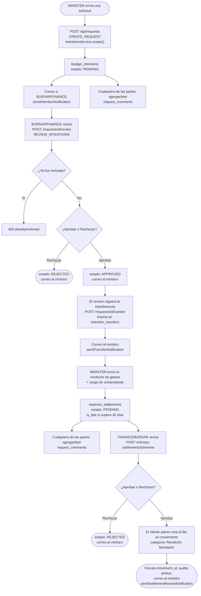

# Flujo de solicitudes (budget intentions workflow)

Nota: `CREATE_REQUEST` (crear solicitud) y `CREATE_SETTLEMENT` (crear rendición) son permisos
independientes desde la migración `20260717030809` — antes eran un único permiso
`SUBMIT_INTENTIONS`. Por defecto `MINISTER` y `ADMIN` tienen ambos habilitados, pero un ADMIN
podría diferenciarlos desde `/settings/permissions`.

Ver también [06-roles-and-permissions.md](06-roles-and-permissions.md) para el detalle de estos
permisos, y `docs/flows.md` para la versión narrada con estados completos (incluyendo el flujo de
rendición y su máquina de estados).
