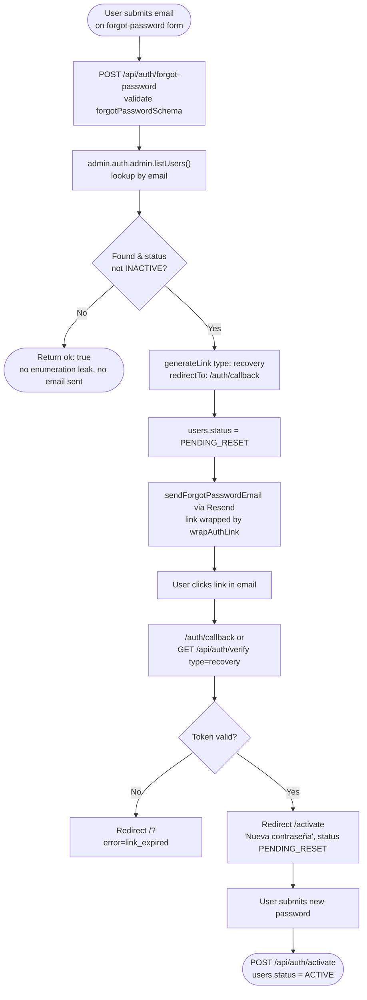

# Password recovery

```mermaid
flowchart TD
    A([User submits email<br/>on forgot-password form]) --> B["POST /api/auth/forgot-password<br/>validate forgotPasswordSchema"]
    B --> C["admin.auth.admin.listUsers()<br/>lookup by email"]
    C --> D{Found & status<br/>not INACTIVE?}
    D -->|No| E([Return ok: true<br/>no enumeration leak, no email sent])
    D -->|Yes| F["generateLink type: recovery<br/>redirectTo: /auth/callback"]
    F --> G[users.status = PENDING_RESET]
    G --> H[sendForgotPasswordEmail via Resend<br/>link wrapped by wrapAuthLink]
    H --> I[User clicks link in email]
    I --> J["/auth/callback or<br/>GET /api/auth/verify type=recovery"]
    J --> K{Token valid?}
    K -->|No| L[Redirect /?error=link_expired]
    K -->|Yes| M["Redirect /activate<br/>'Nueva contraseña', status PENDING_RESET"]
    M --> N[User submits new password]
    N --> O(["POST /api/auth/activate<br/>users.status = ACTIVE"])
```
