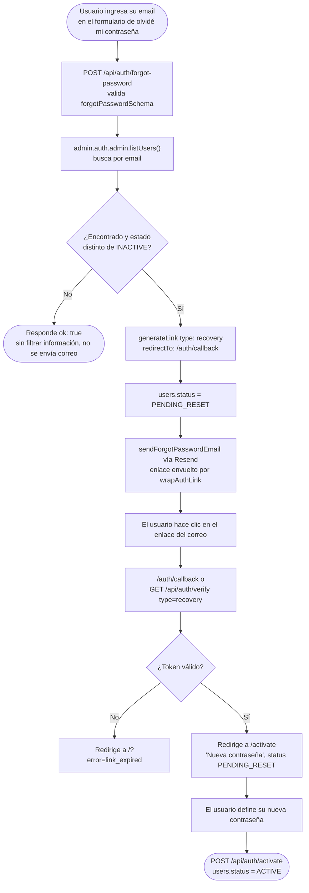

# Recuperación de contraseña

Sin registro público de enumeración: si el email no existe (o pertenece a un usuario
`INACTIVE`), el sistema responde igual que si el correo se hubiera enviado, sin filtrar
información.

Ver también [07-login-and-impersonation.md](07-login-and-impersonation.md) para el flujo de
inicio de sesión, y [roles.md](../roles.md#user-status-lifecycle) para el ciclo de vida completo
de `users.status`.
