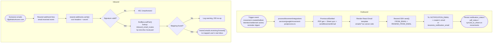

# Email sending / receiving

```mermaid
flowchart TD
    subgraph Outbound
        A([Trigger event<br/>movement created/edited,<br/>intention/settlement action,<br/>reminder digest]) --> B[processMovementIntegrations<br/>services/google/movement-postprocess.ts]
        B --> C["Promise.allSettled:<br/>PDF gen + Sheet sync + sendMovementEmail"]
        C --> D[Render React Email template<br/>emails/*.tsx server-side]
        D --> E["Resend SDK send()<br/>FROM_EMAIL = RESEND_FROM_EMAIL"]
        E --> F[To: NOTIFICATION_EMAIL + creator's email<br/>or tesoreria_notification_email]
        F --> G([Persist notification_status /<br/>pdf_status / synced_to_sheet on movements])
    end

    subgraph Inbound
        H([Someone emails<br/>*@pibtalcahuano.com]) --> I[Resend webhook fires<br/>email.received event]
        I --> J["resend.webhooks.verify()<br/>svix headers + secret"]
        J --> K{Signature valid?}
        K -->|No| L[401 Unauthorized]
        K -->|Yes| M["findByLocalPart()<br/>lookup inbound_email_routes<br/>by to/cc/bcc local-part"]
        M --> N{Mapping found?}
        N -->|No| O[Log warning, 200 no-op]
        N -->|Yes| P(["resend.emails.receiving.forward()<br/>to mapped user's real inbox"])
    end
```
