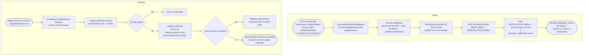

# Envío y recepción de correo

```mermaid
flowchart TD
    subgraph Salida
        A(["Evento disparador<br/>movimiento creado/editado,<br/>acción sobre solicitud/rendición,<br/>resumen de recordatorios"]) --> B[processMovementIntegrations<br/>services/google/movement-postprocess.ts]
        B --> C["Promise.allSettled:<br/>generación de PDF + sync de Sheet + sendMovementEmail"]
        C --> D[Renderiza la plantilla de React Email<br/>emails/*.tsx en el servidor]
        D --> E["SDK de Resend send()<br/>FROM_EMAIL = RESEND_FROM_EMAIL"]
        E --> F[Para: NOTIFICATION_EMAIL + email de quien lo creó<br/>o tesoreria_notification_email]
        F --> G(["Persiste notification_status /<br/>pdf_status / synced_to_sheet en movements"])
    end

    subgraph Entrada
        H(["Alguien envía un correo a<br/>*@pibtalcahuano.com"]) --> I[Se dispara el webhook de Resend<br/>evento email.received]
        I --> J["resend.webhooks.verify()<br/>encabezados svix + secreto"]
        J --> K{"¿Firma válida?"}
        K -->|No| L[401 No autorizado]
        K -->|Sí| M["findByLocalPart()<br/>busca en inbound_email_routes<br/>por local-part de to/cc/bcc"]
        M --> N{"¿Se encontró un mapeo?"}
        N -->|No| O[Registra advertencia, responde 200 sin hacer nada]
        N -->|Sí| P(["resend.emails.receiving.forward()<br/>al buzón real del usuario mapeado"])
    end
```
