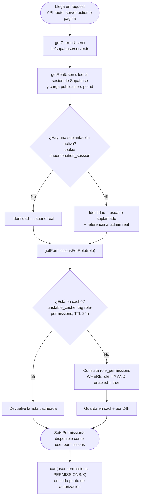
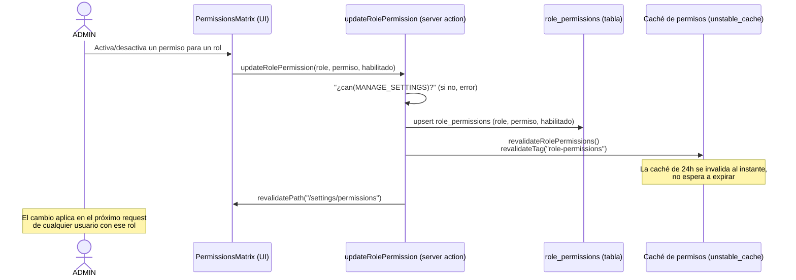

# Roles y flujo de permisos

Cuatro roles: `ADMIN` (Administrador), `BURSAR` (Tesorero), `FINANCE` (Finanzas) y `MINISTER`
(Ministro). La autorización es **por permiso, no por nombre de rol**: casi toda la lógica de
negocio llama a `can(permisos, PERMISSIONS.X)`, nunca compara `role === "ADMIN"` directamente.

## Matriz de permisos

Valores por defecto (configurables por un ADMIN desde **Configuración → Permisos**,
`/settings/permissions`):

| Permiso              | Administrador | Tesorero | Finanzas | Ministro |
| ---------------------- | :-----------: | :------: | :------: | :------: |
| Gestionar usuarios      |      ✓        |    —     |    —     |    —     |
| Crear/editar movimientos |     ✓        |    ✓     |    —     |    —     |
| Ver movimientos         |      ✓        |    ✓     |    ✓     |    —     |
| Ver dashboard general   |      ✓        |    ✓     |    ✓     |    —     |
| Gestionar ministerios   |      ✓        |    ✓     |    —     |    —     |
| Gestionar categorías    |      ✓        |    ✓     |    —     |    —     |
| Revisar solicitudes     |      ✓        |    ✓     |    —     |    —     |
| Crear solicitudes       |      ✓        |    —     |    —     |    ✓     |
| Crear rendiciones       |      ✓        |    —     |    —     |    ✓     |
| Gestionar remuneraciones |     ✓        |    —     |    —     |    —     |
| Gestionar configuración |      ✓        |    —     |    —     |    —     |

Los permisos de Administrador son inmutables desde la interfaz — nunca puede quitárselos a sí
mismo. Los demás roles se editan en vivo desde la matriz de permisos.

## Cómo se resuelven los permisos en cada request

## Cómo un ADMIN edita la matriz de permisos

## Notas de diseño

- `VIEW_WORKFLOW` no es un permiso independiente en la práctica: el acceso al flujo de
  solicitudes se deriva de tener `CREATE_REQUEST`, `CREATE_SETTLEMENT` o `REVIEW_INTENTIONS`
  (función `canAccessWorkflow()`), por eso no aparece como casilla editable.
- `MANAGE_CATEGORIES` y `MANAGE_PAYROLL` existen como filas en `role_permissions` (sembradas por
  migración) pero tampoco aparecen en la matriz editable todavía — son permisos angostos, no de
  uso frecuente por un ADMIN.
- Un usuario `MINISTER` solo ve las solicitudes de **su propio** ministerio — esto no es un
  permiso adicional, sino una restricción de alcance (`isMinisterWorkflowUser()` + RLS) aplicada
  sobre `CREATE_REQUEST`/`CREATE_SETTLEMENT`.

Ver también [roles.md](../roles.md) para el detalle completo de cada permiso y
[07-login-and-impersonation.md](07-login-and-impersonation.md) para cómo la suplantación de
usuarios interactúa con este flujo (la identidad efectiva puede no ser la del usuario
autenticado).
