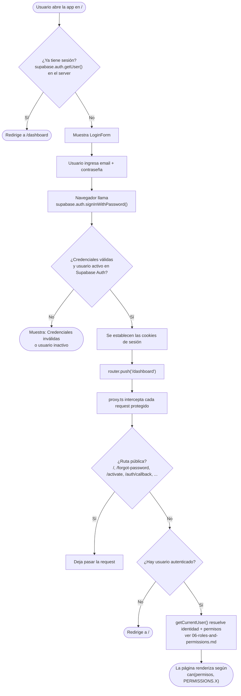
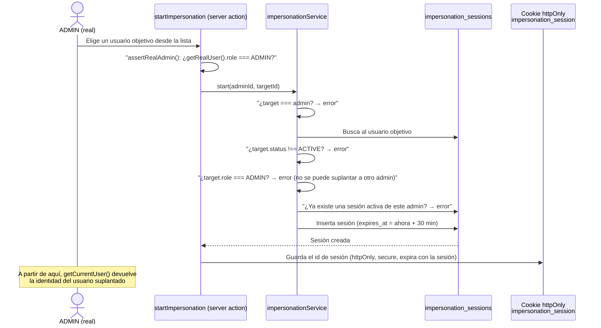
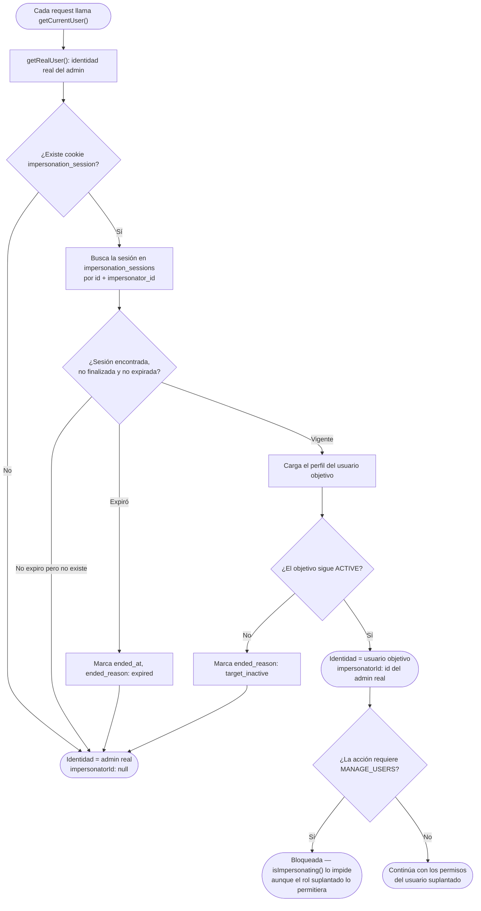

# Inicio de sesión y suplantación de usuarios

## Inicio de sesión

No hay registro público — las cuentas las crea un ADMIN (ver
[02-account-creation.md](02-account-creation.md)). El login usa Supabase Auth directamente desde
el navegador; el middleware (`proxy.ts`) protege el resto de las rutas.

Nota: Supabase Auth valida la contraseña; el mensaje de error en la UI es intencionalmente
genérico ("credenciales inválidas o usuario inactivo") para no revelar si el problema es el
email, la contraseña, o que la cuenta está `INACTIVE`/no `ACTIVE` en `public.users`.

Para el flujo de "olvidé mi contraseña", ver
[04-password-recovery.md](04-password-recovery.md).

## Suplantación de usuarios ("Impersonation")

Un ADMIN puede actuar temporalmente como otro usuario (no-ADMIN, activo) para reproducir un
problema sin necesitar su contraseña. Es una superposición a nivel de sesión — nunca modifica
`users.role` ni la sesión de autenticación real.

## Reglas clave

- Solo un ADMIN **real** (no un ADMIN suplantado — imposible, de todas formas, ya que no se puede
  suplantar a otro ADMIN) puede iniciar o detener una suplantación.
- Una sola sesión de suplantación activa por administrador a la vez.
- Duración fija de 30 minutos, controlada en el servidor (`impersonation_sessions.expires_at`),
  no solo por la cookie del navegador.
- `MANAGE_USERS` queda bloqueado mientras se suplanta a alguien, para evitar que la suplantación
  se use para escalar privilegios de gestión de usuarios más allá de lo que el admin real
  pretendía.
- Si el usuario suplantado es desactivado durante la sesión, esta se termina automáticamente
  (`ended_reason: target_inactive`) y la identidad vuelve a ser la del admin real, sin error.
- Motivos de cierre: `manual` (el admin la detiene), `expired` (venció el plazo),
  `target_inactive`, `forced` (reservado para un cierre forzado futuro).

Ver también [roles.md](../roles.md#impersonation-suplantación-de-usuarios) y
[06-roles-and-permissions.md](06-roles-and-permissions.md).
