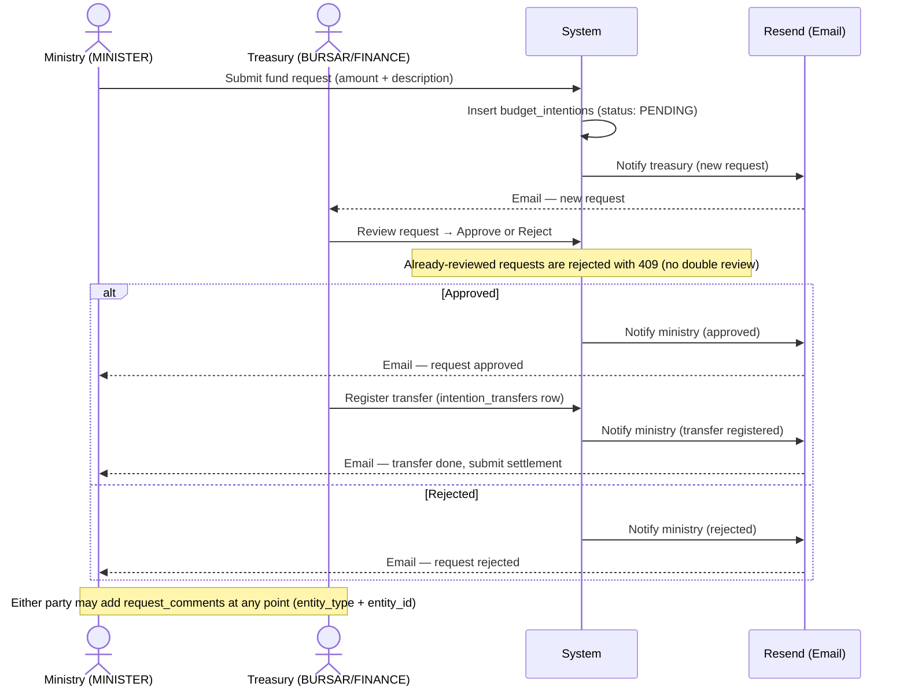
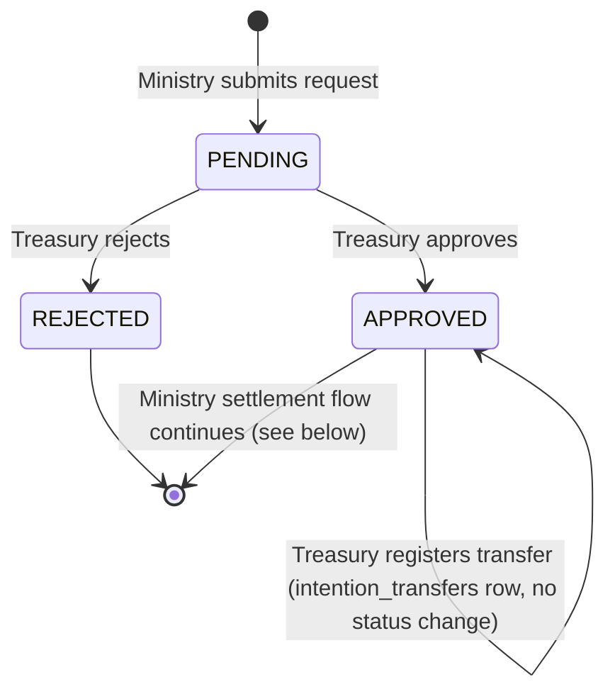
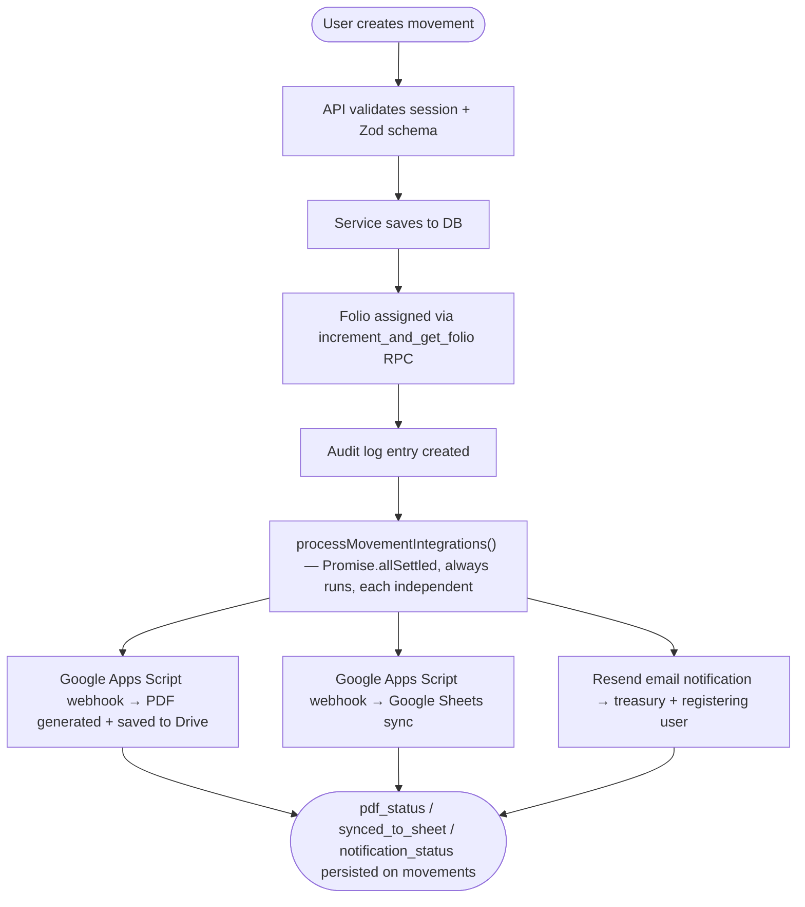
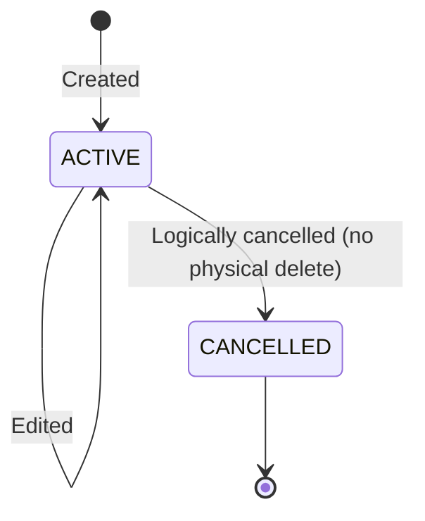

# Business Flow Diagrams

## Fund Request Flow (Solicitud de Fondos)

A ministry submits a fund request (intention). Treasury reviews it, registers the transfer,
and the ministry must later submit a settlement with receipts.



Note: there is no per-ministry budget check anymore — budget allocation tracking was removed
from the platform (see CLAUDE.md); budgets are tracked outside the system.

### States

`budget_intentions.status` is a 3-value enum: `PENDING | APPROVED | REJECTED` — that's it.
Transfer registration and settlement are **not** intention states; they live in separate tables
(`intention_transfers`, `expense_settlements`) linked to the intention.



---

## Settlement Flow (Rendición de Fondos)

After receiving a transfer, the ministry submits expense receipts for treasury review.

```mermaid
sequenceDiagram
    actor Minister as Ministry (MINISTER)
    actor Treasury as Treasury (BURSAR/FINANCE)
    participant System as System
    participant Email as Resend (Email)

    Note over Minister: Transfer has been registered

    Minister->>System: Submit settlement + proof (attachment upload, see 01-file-uploading)
    System->>System: Insert expense_settlements (status: PENDING, is_late if >30 days from expense_date)

    Treasury->>System: Review settlement → Approve or Reject
    Note over System: Already-reviewed settlements are rejected with 409 (no double review)

    alt Approved
        System->>System: Admin client inserts movements row (folio via increment_and_get_folio RPC, category "Rendición Ministerio")
        System->>System: Link movement_id back onto the settlement; audit-log both
        System->>Email: Notify ministry (settlement approved)
        Email-->>Minister: Email — settlement approved
    else Rejected
        System->>Email: Notify ministry (settlement rejected)
        Email-->>Minister: Email — settlement rejected, resubmit
        Minister->>System: Resubmit corrected settlement
    end
```

Note: `expense_settlements.status` is also `PENDING | APPROVED | REJECTED` — no `SETTLED` value.
Approval is the point where a real `movements` row gets created; it bypasses normal RLS via the
service-role client because `movements` inserts are otherwise restricted to ADMIN/BURSAR.

---

## Movement Registration Flow (Movimientos)

Standard income or expense recording with audit trail and always-on integrations.



Note: all three integrations always fire in parallel — there's no feature flag gating them.
`allSettled` means one failing (e.g. PDF generation error) never blocks the others; each
outcome is persisted independently on the `movements` row.

### Movement states



---

## Scheduled Reminders

A Supabase cron job (`supabase/migrations/20260426000002_reminder_cron.sql`) runs periodically
and sends a summary email to treasury when there are pending items.


